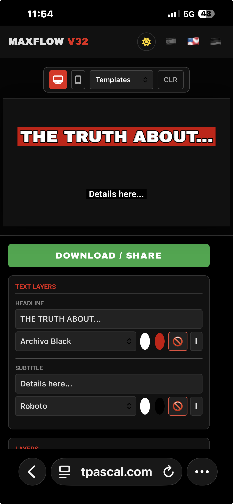
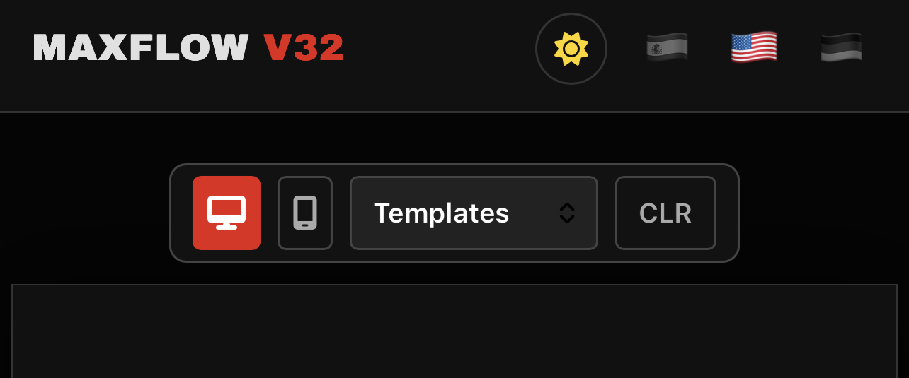
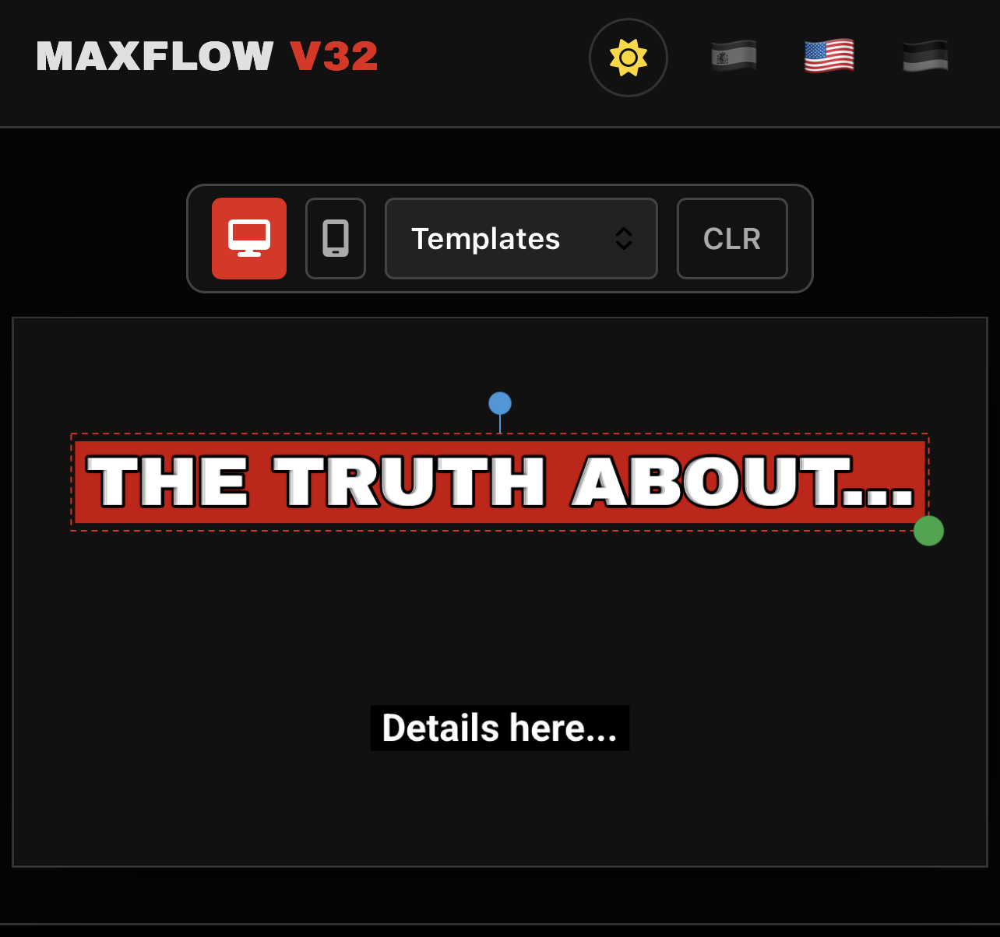
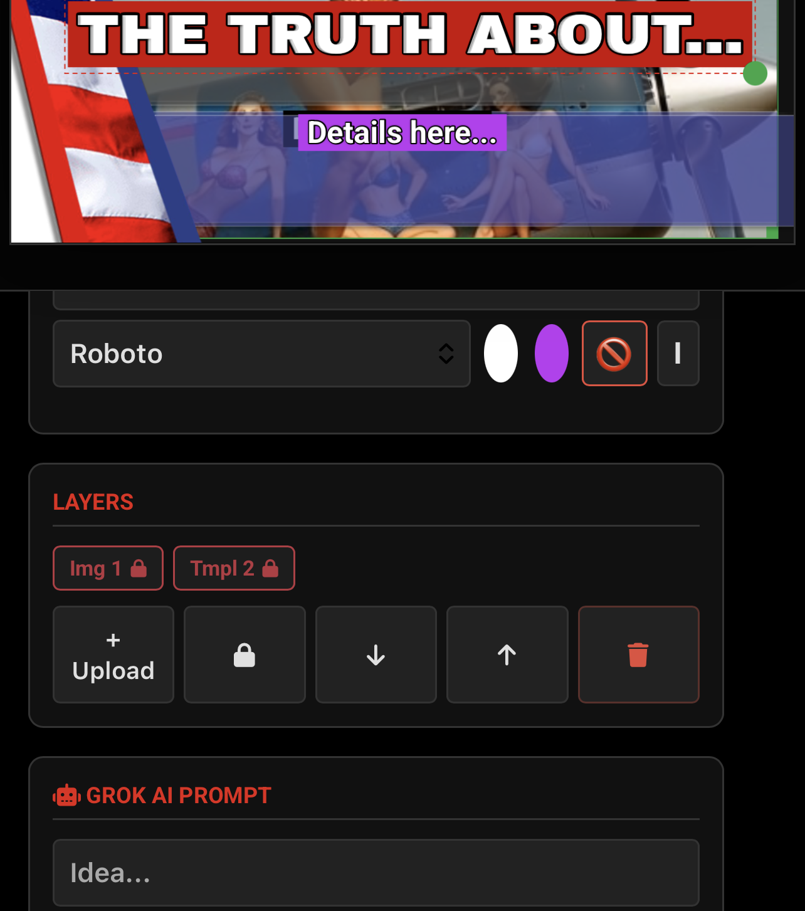
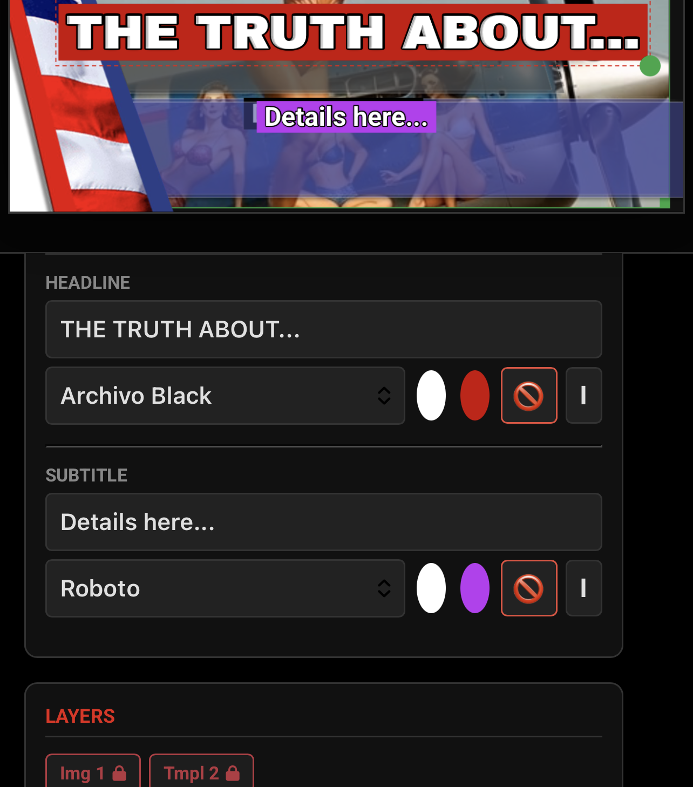
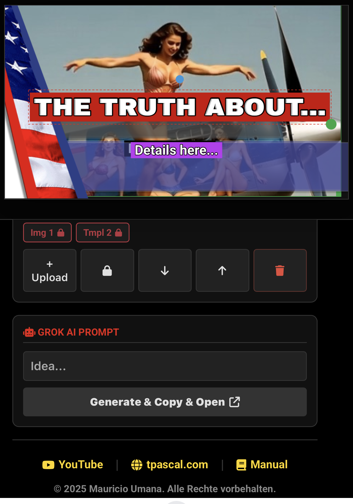

# 📘 MaxFlow  
### Professional YouTube Thumbnail Studio

**MaxFlow** is a lightweight, browser-based design application created to produce high-impact thumbnails for **YouTube, Shorts, TikTok, and Instagram** — quickly, securely, and without cloud dependency.

The application runs entirely in your browser and stores all data locally.

🌐 Live App:  
👉 https://tpascal.com/nail/index.html

---

## ✨ Key Features

- Offline-capable web application
- No accounts, no tracking, no cloud storage
- Drag-and-drop canvas editor
- Layer management with locking system
- High-contrast text styling with automatic stroke
- AI prompt generator for external image creation (Grok)
- Mobile and desktop export support

---

## 🖥️ Interface Overview

---

## 🚀 Quick Start

1. **Select Aspect Ratio**  
   Choose:
   - **16:9** for YouTube thumbnails  
   - **9:16** for Shorts, Reels, or TikTok

2. **Load a Template (Optional)**  
   Use the **Templates** dropdown to apply a predefined background.

3. **Edit Text**  
   - Click or tap text directly on the canvas to move it
   - Modify content and style using the right-hand control panel

4. **Upload Images**  
   Click **`+ Upload`** to add images from your device

---

## 🎨 Editing Tools

### 🖱️ Direct Canvas Manipulation

- **Move:** Drag any selected element
- **Resize:** Use the green handle (bottom-right)
- **Rotate:** Use the blue rotation handle above text

---

### 🗂️ Layer Management

The Layers panel allows precise control:

- **Bring Forward / Send Back** (`⬆` / `⬇`)
- **Lock (🔒):** Prevents accidental movement (ideal for backgrounds)
- **Delete (🗑️):** Removes the selected element

Locked elements remain selectable from the layer list.

---

### ✍️ Text Styling

- High-impact fonts (e.g. *Archivo Black*, *Bangers*)
- Text color selection
- Optional background box
- **No Background Mode (🚫)**
- Automatic black outline for maximum readability

---

## 🤖 AI Prompt Generator (Grok)

MaxFlow includes an AI prompt assistant for background creation.

1. Enter a description in **Grok AI Prompt**  
   Example: